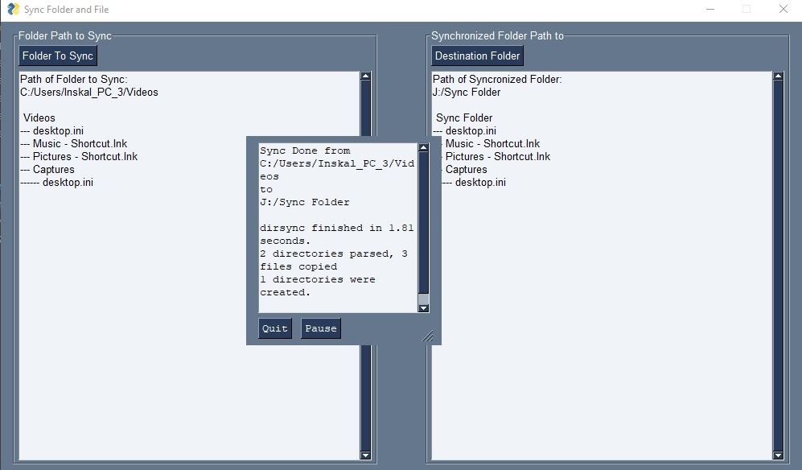

# Python-GUI-for-Sync-Folder-Files
Python GUI for Sync Folder Files between Two Folder

Reference:
https://stackoverflow.com/questions/63725995/how-to-display-files-in-folder-when-using-pysimplegui-filebrowse-function
https://stackoverflow.com/questions/16953842/using-os-walk-to-recursively-traverse-directories-in-python
https://pypi.org/project/dirsync/
https://www.instructables.com/Syncing-Folders-With-Python/
https://pysimplegui.readthedocs.io/en/latest/cookbook/#recipe-printing-34-print-to-multiline-element
https://www.programcreek.com/python/example/115993/PySimpleGUI.Multiline

## Screenshoot

***Figure. 2.*** *Example of data log file.*
